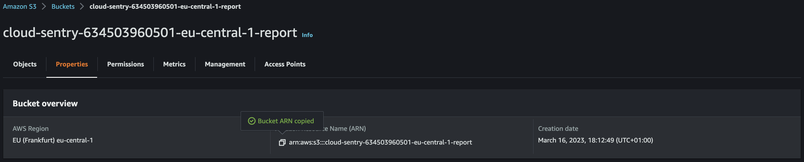
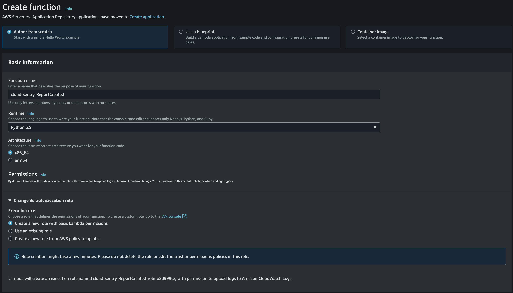
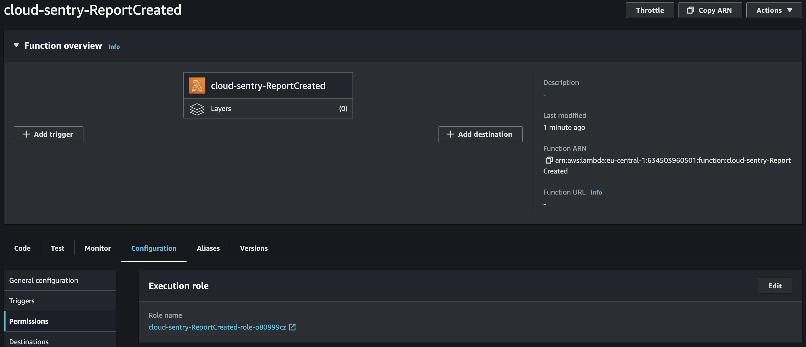
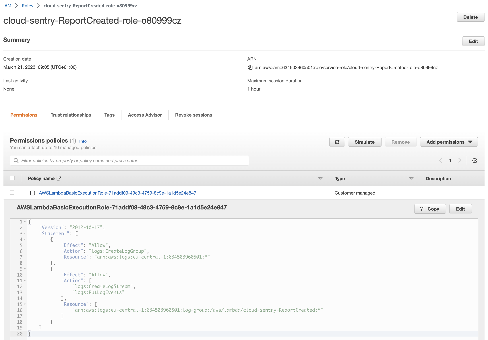
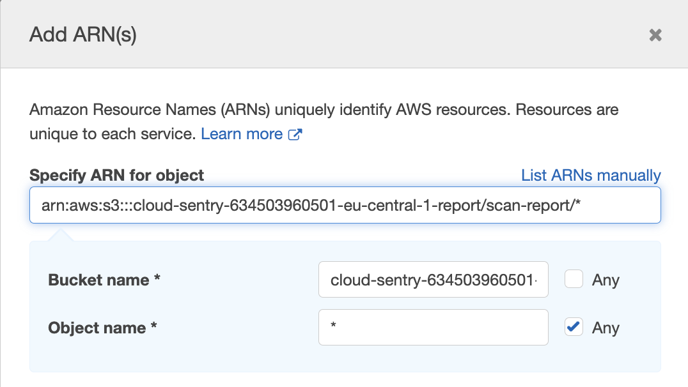
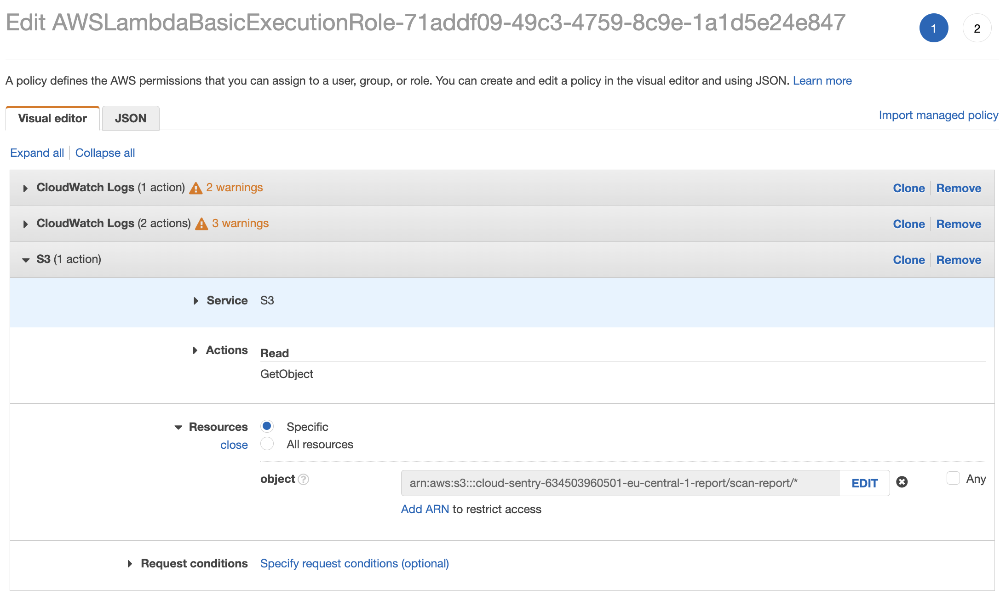
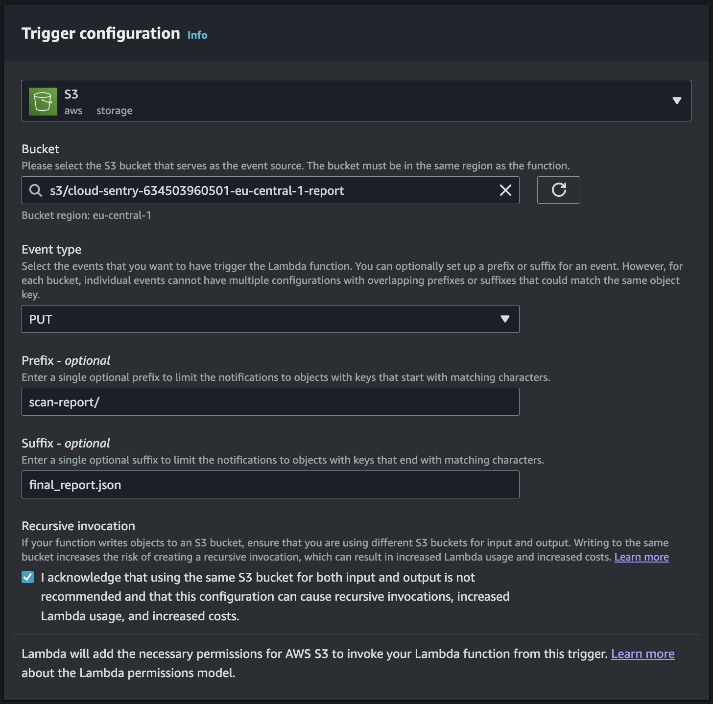

# Sentry Reports to CloudWatch

This repo describes a simple way to feed CloudWatch with Sentry reports chronologically using Lambda.

Since the Lambda and the S3 bucket containing Sentrys output need to be in the same region one does need to replicate the same setup for all your relevant regions.

- [Sentry Reports to CloudWatch](#sentry-reports-to-cloudwatch)
  - [Get the S3 ARN](#get-the-s3-arn)
  - [Create the Lambda function](#create-the-lambda-function)
  - [Configure the S3 Notification](#configure-the-s3-notification)
  - [Test it](#test-it)
  - [Outlook](#outlook)
  - [Support](#support)
  - [Contribute](#contribute)

## Get the S3 ARN

First, we need the ARN of the regions bucket containing the Sentry reports. Go to S3 and identify the bucket with the name following the schema `cloud-sentry-<ACCOUNT ID>-<REGION>-report`.



Select the bucket and cope the ARN from the Properties tab. Save it somewhere for now, we'll need this shortly.

## Create the Lambda function

Next, go to Lambda --> Create function.

Leave it to `Author from scratch`.

Parameter | Value
--------- | -----
Name | Whatever you want, e.g. `cloud-sentry-ReportCreated`
Runtime | `Python 3.9`
Architecture | `x86_64`
Execution role | `Create a new role with basic Lambda permissions`



Press `[Create Function]`.

Now you modify the roles policy. Basically you need to add `s3:GetObject` on the resource `YOUR S3 Bucket ARN`.

To do this, go to the Lambdas `Configuration --> Permissions` and click on the Role name.



Now, expand the Policy and click on `[Edit]`



Press `Add additional permissions`.

Choose

- Service `S3`
- Actions `Read - GetObject`
- Resources `Specific`

Click an `Add ARN` and paste the S3 Bucket ARN from above followed by `/scan-report/*`.



Now `[Review policy]` and `[Save changes]`.

Your resulting Lambda Policy should look like this.

```json
{
    "Version": "2012-10-17",
    "Statement": [
        {
            "Sid": "VisualEditor0",
            "Effect": "Allow",
            "Action": [
                "s3:GetObject",
                "logs:CreateLogGroup"
            ],
            "Resource": [
                "arn:aws:logs:eu-central-1:634503960501:*",
                "arn:aws:s3:::cloud-sentry-634503960501-eu-central-1-report/scan-report/*"
            ]
        },
        {
            "Sid": "VisualEditor1",
            "Effect": "Allow",
            "Action": [
                "logs:CreateLogStream",
                "logs:PutLogEvents"
            ],
            "Resource": "arn:aws:logs:eu-central-1:634503960501:log-group:/aws/lambda/cloud-sentry-ReportCreated:*"
        }
    ]
}
```



Back to your Lambda function replace the Code with the following:

```python
import json
import urllib.parse
import boto3

s3 = boto3.client('s3')

def lambda_handler(event, context):
    #print("Received event: " + json.dumps(event, indent=2))

    # Get the object from the event
    bucket = event['Records'][0]['s3']['bucket']['name']
    key = urllib.parse.unquote_plus(event['Records'][0]['s3']['object']['key'], encoding='utf-8')

    try:
        response = s3.get_object(Bucket=bucket, Key=key)
        body = response['Body'].read().decode('utf-8')
        print("CONTENT TYPE: " + response['ContentType'])
        print("REPORT: " + body)
        #print("REPORT: " + json.dumps(body, indent=2))

        return response['ContentType']
    except Exception as e:
        print(e)
        print('Error getting object {} from bucket {}. Make sure they exist and your bucket is in the same region as this function.'.format(key, bucket))
        raise e
```

Don't forget to sava the lambda function. Press `[Deploy]`.

Copy the Lambdas ARN and save it somewhere for now, we'll need it for the S3 Notification.

## Configure the S3 Notification

Now, the last step. We need to send an event to the Lambda whenever a new file (report) is dropped to our bucket.

Press `[+ Add trigger]`  and select S3 as the source.

As the Bucket choose your report bucket from above.

Property | Value
-------- | -----
Name | Whatever you want, e.g. `sentrystackset-f8a28-stackresourcebucket-report-notification`
Prefix | `scan-report/`
Suffix | `final_report.json`
Event types | Check `Object creation - Put`



Press `[Add]`. Done.

## Test it

Now trigger some scans.

```sh
FUNCTION_SPF=$(aws lambda list-functions | jq -r '.Functions[] | select(.FunctionName |
    contains("-ResourceCollector")) | .FunctionName')

aws lambda invoke --function-name $FUNCTION_SPF --cli-binary-format raw-in-base64-out \
    --payload '{}' response.json
```

When they succeed head over to the CloudWatch logs of your new Lambda. Open the Monitor tab and press `[View CloudWatch logs]`.

Here's an example how it should look like (here for a Lambda scan):

```log
INIT_START Runtime Version: python:3.9.v18	Runtime Version ARN: arn:aws:lambda:eu-central-1::runtime:edb5a058bfa782cb9cedc6d534ac8b8c193bc28e9a9879d9f5ebaaf619cd0fc0
START RequestId: ab8cfeab-96ff-4d3f-93d5-18c9f23751c4 Version: $LATEST
CONTENT TYPE: binary/octet-stream
REPORT: 
{
    "scanID": "634503960501-31503c52-c6f6-4d7f-9f6b-690a80edda3e-1679387594",
    "resourceType": "aws-lambda-function",
    "resourceID": "arn:aws:lambda:eu-central-1:634503960501:function:Storage-TM-FileStorageSec-SetupBucketNotificationL-IMPZcIjLGFTj",
    "metadata": {
        "AWSAccountID": "634503960501",
        "FunctionARN": "arn:aws:lambda:eu-central-1:634503960501:function:Storage-TM-FileStorageSec-SetupBucketNotificationL-IMPZcIjLGFTj",
        "FunctionName": "Storage-TM-FileStorageSec-SetupBucketNotificationL-IMPZcIjLGFTj"
    },
    "timestamp": "2023-03-21T08:33:19Z",
    "antimalwareFull": [],
    "integrityMonitoring": {
        "findings": []
    }
}

END RequestId: ab8cfeab-96ff-4d3f-93d5-18c9f23751c4
```

## Outlook

Very similar to Cloud One File Storage Security one could think of sending an email notification when a report with findings got created, trigger some other workflows, etc. The sky is the limit.

## Support

This is an Open Source community project. Project contributors may be able to help, depending on their time and availability. Please be specific about what you're trying to do, your system, and steps to reproduce the problem.

For bug reports or feature requests, please [open an issue](../../issues). You are welcome to [contribute](#contribute).

Official support from Trend Micro is not available. Individual contributors may be Trend Micro employees, but are not official support.

## Contribute

I do accept contributions from the community. To submit changes:

1. Fork this repository.
2. Create a new feature branch.
3. Make your changes.
4. Submit a pull request with an explanation of your changes or additions.

I will review and work with you to release the code.